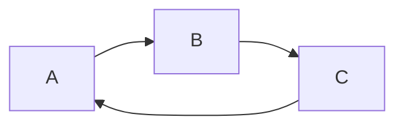
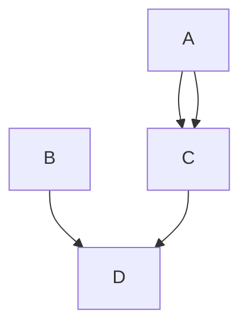

[TOC]

最高阶标题
=

第二阶标题
-

# 标题--第1阶
## 标题--第2阶

<!-- more -->

### 标题--第3阶
#### 标题--第4阶
##### 标题--第5阶
###### 标题--第6阶
<span id="anchor">锚点目标位置</span>
## 修辞和强调   
使用 `*`、`_` 作为标记，文字变成斜体   
使用 `**`、`__` 作为标记，文字变成粗体   
使用 `~~` 在文字前后添加删除线

*斜体*   _斜体_   
**强调**   __强调__   
~~删除线~~   

## 列表
有序列表和无序列表

#### 无序列表使用*、+、- 作为列表项目的标志。

* red
* green
* black

+ good
  
  在一个列表项目中放多个段落，先插入一个空行，需要前面缩进4个空白或一个tab
+ better
+ best

- big
- small

#### 有序列表

1. sun
2. moon
3. star

## 表格
使用 `|` 进行分割   
| 笔记 | 更新 | 版本 |
|------|-----|-----|
| note | refresh | version|


## 链接
  行内和参考两种方式，都是使用角括号把文字转成链接。
  参考链接可以为链接定一个名称，可以在文件的其他地方定义该链接的内容，链接名称可以为字母、数字、空格，但是不区分大小写
  
  语法：
  * [行内链接](<http://example.com>
      'with a title'
    )

    `[行内链接](<http://example.com>'with a title')`
  * [参考链接][3]

    [3]: <http://search.msn.com/> 
          'MSN Search'
    ```
    [参考链接][3]

    [3]: <http://search.msn.com/> 
          'MSN Search'
    ```
  【注】：
  * title属性可选 
  * title可以使用单引号、双引号、括弧包着( `''`，`""`，`()`  )。
  * 网址可以使用`<>`包起来。栗子：`this is an [example link](<http://example.com>)`
  * 可以将title放在下一行，也可以增加一些缩进，让代码看起来好看。
    
  栗子：
  
  行内链接：this is an [example link](http://example.com)

  `this is an [example link](http://example.com)`  
  带title的链接： [example link](http://example.com/ 'with a title')

  `[example link](http://example.com/ 'with a title')`

  参考链接：
I get 10 times more traffic from [Google][1] than from [Yahoo][2] or [MSN][3].

[1]: http://google.com/ 'Google'
[2]: http://search.yahoo.com/ 'Yahoo Search'
[3]: http://search.msn.com/ 'MSN Search'
```
I get 10 times more traffic from [Google][1] than from [Yahoo][2] or [MSN][3].

[1]: http://google.com/ 'Google'
[2]: http://search.yahoo.com/ 'Yahoo Search'
[3]: http://search.msn.com/ 'MSN Search'
```

隐式链接标记功能，链接不指定名称，默认为链接文字。   
用法：在链接文字后面加空的方括号。   
栗子：[Google][]   

[Google]: http:google.com/
```
[Google][]

[Google]: http:google.com/
```

## 图片
* 行内连接 （title 是可选属性）  
  语法：`` 
  

## 其他链接
自动链接：将网址直接用尖括号包裹即可` <http://www.baidu.com>`
 <http://www.baidu.com>

## 锚点
  [锚点链接](#anchor)
  语法：
  `[锚点链接](#anchor)` 
  `<span id="anchor">锚点目标位置</span>`

## 代码
在一般的段落文字中，使用反引号(`)来标记代码区段，区段内的&、< 和 > 都会被自动转换成html实体，这样可以很容易的在代码区段内插入html 代码。   

I strongly recommend against using any `<blink>` tags.   
## 代码块
在代码前后增加三个反引号`(```)`，如果需要指定语言，在开头的```后紧跟具体语言。(java, pathon, javascript)
``` java
  int i = 0; i = 1;
  for(int i = 0; i < 100; i++) {
    printf('hello markdown\n');
  }
```
如果要建立一个已经格式化好的代码区块，只要每行都缩进4个空格或者一个 tab 就可以了，而&、< 和 > 也一样会自动转成 html 实体。

## 代码区块
4个空格或者2个制表符可以开始代码区块, 一个代码区块会一直持续到没有缩进的那一行。

在代码区块中，一般的markdown语法不会被转换

    圣诞节法律框架房拉克丝京东方啦会计法拉克丝 肯德基发卡量双方均按时离开的房间爱可代发
    **强调**，不会转换
    *修饰*，不会转换
    时打开就发了时代峰峻绿山咖啡看电视剧法兰克

可以在markdown文件中直接使用html标签，`<div>`、`<table>`、`<pre>`、`<p>`等标签，必须在前后加上空行与其他内容区隔开，还要求他们的开始标签和结束标签不能使用制表符或空格来缩进。

注意：在html区块内使用markdown样式会没有效果

## 引用   
在文字前 添加 `>`，在引用内也可以使用markdown语法
```
  > 如果你无法简洁的表达你的想法，那只说明你还不够了解它。 -- 阿尔伯特·爱因斯坦

  > # 标题一
  > ## 标题二
```
> 如果你无法简洁的表达你的想法，那只说明你还不够了解它。 -- 阿尔伯特·爱因斯坦

> # 标题一
> ## 标题二

## 区块引用
<blockquote>
  <p>for example</p>
  example
</blockquote> 

## 文件链接
在需要添加文件链接的词语后面添加`[^1]`，结尾加入`[^1]: 链接文件路径`   
hello[^1]   

[^1]: ./02test.md

## 分割线
一行中3个以上的 *、-、_ 可建立分割线， 行内不能有其他东西，可以有空格

***
---
___   

## 特殊字符自动转换
在html文件中，有两个字符需要特殊处理：< 和 & 。< 符号用于起始标签，&符号用于标记html实体，如果显示原型，需要使用实体的形式：`&lt;` 和 `&amp;`

## 反斜杠 \\
markdown 可以利用 \ 来插入一些在语法上有其他意义的符号。markdown支持一下这些符号加上反斜杠来帮助输入普通的符号。   

    \ 反斜线
    ` 反引号
    * 星号
    _ 底线
    {} 花括号
    [] 方括号
    () 括弧
    # 井字号
    + 加号
    - 减号
    . 英文句点
    ! 惊叹号


## markdown preview enhanced 插件

### 图像
1. mermaid

暂时没有找到hexo渲染mermaid的方法



## 流程图（flowchart）
  在博客使用流程图 
  1. npm install --save hexo-filter-flowchart
  2. 在_config.yml中配置
  

  ```
    flowchart:
    # raphael:   # optional, the source url of raphael.js
    # flowchart: # optional, the source url of flowchart.js
    options: # options used for `drawSVG`
  ```
  栗子：
  ```
    flow
      st=>start: Start|past:>http://www.google.com[blank]
      e=>end: End:>http://www.google.com
      op1=>operation: My Operation|past
      op2=>operation: Stuff|current
      sub1=>subroutine: My Subroutine|invalid
      cond=>condition: Yes
      or No?|approved:>http://www.google.com
      c2=>condition: Good idea|rejected
      io=>inputoutput: catch something...|request

      st->op1(right)->cond
      cond(yes, right)->c2
      cond(no)->sub1(left)->op1
      c2(yes)->io->e
      c2(no)->op2->e
    
  ```
```flow
st=>start: Start|past:>http://www.google.com[blank]
e=>end: End:>http://www.google.com
op1=>operation: My Operation|past
op2=>operation: Stuff|current
sub1=>subroutine: My Subroutine|invalid
cond=>condition: Yes
or No?|approved:>http://www.google.com
c2=>condition: Good idea|rejected
io=>inputoutput: catch something...|request

st->op1(right)->cond
cond(yes, right)->c2
cond(no)->sub1(left)->op1
c2(yes)->io->e
c2(no)->op2->e
```

## 关于博客中添加图片
在博客中添加图片，图片地址为：https://raw.githubusercontent.com/yourname/yourname.github.io/master/foldername/filename.xxx;


